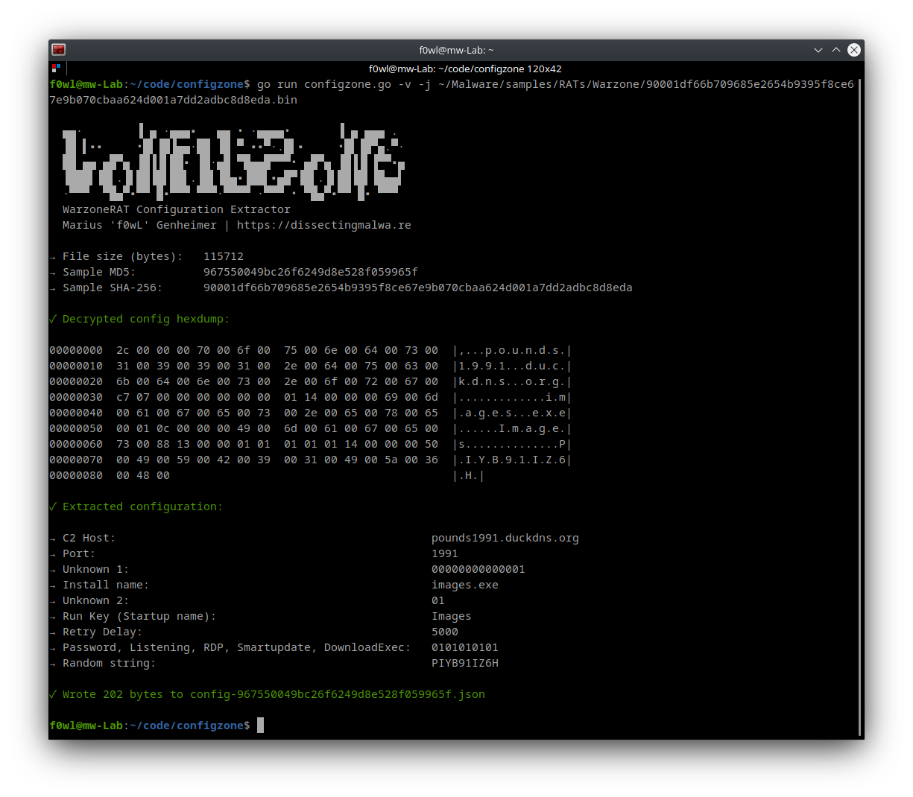

# configzone

Configzone is a static configuration extractor implemented in Golang for Warzone RAT (targeting Microsoft Windows). By default the script will print the extracted information to stdout (using the ```-v``` (verbose) flag is recommended for deeper investigations (hexdump, debug information in case of errors). It is also capable of dumping the malware configuration to disk as a JSON file with the ```-j``` flag.

### Usage 

```shell
go run configzone.go [-v] [-j] path/to/sample.exe
```
### Screenshots



<p align="center">

</p>

## Sources/Credits

The idea of this config extractor is based on the work of Sergei Frankoff (OALabs), who covered the [reverse engineering](https://www.youtube.com/watch?v=81fdvmGmRvM) of Warzone RAT and [basic config extraction](https://www.youtube.com/watch?v=-G82xh9m4hc) in a video series on the OALabs Youtube channel.

The analysis write-ups by [Domaintools](https://www.domaintools.com/resources/blog/warzone-1-0-rat-analysis-report) and Yaroslav Harakhavik for [Checkpoint Research](https://research.checkpoint.com/2020/warzone-behind-the-enemy-lines/) were very useful as well.

## Configuration layout/contents

The table below shows the keys used in the configuration of Warzone RAT. Some of these values could not be confirmed through reverse engineering the malware, yet. Multiple values were deducted from the screenshot created by Domaintools below and a [leaked version of Warzone RAT 1.84](https://github.com/ctoslab/WARZONE/blob/main/WARZONE%20RAT%201.84%20CRACKED/WARZONE%20RAT%201.84_crack.exe.config).

<p align="center">

</p>


|          Option             | Length in Bytes |    Color   |                     Value / Purpose                    | Confirmed via Reverse Engineering |
| :-------------------------: |:---------------:|:----------:|:-----------------------------------------------------: |:---------------------------------:|
|         Host offset         |        4        | Light Blue |        Length of the Command&Control Domain/IP         |                 ✅                |
|           C2 Host           |        x        |   Green    |               Command&Control Domain/IP                |                 ✅                |
|           C2 Port           |        2        |   Orange   |              Command&Control Server Port               |                 ✅                |
|           Unknown           |        7        |    Red     |                  currently unknown                     |                 ❌                |
|    Install name offset      |        4        | Light Blue |         Length of the Executable/Process name          |                 ✅                |
|         Install name        |        x        |   Yellow   |               Executable/Process name                  |                 ✅                |
|           Unknown           |        1        |    Red     |                  currently unknown                     |                 ❌                |
|       Run Key Offset        |        4        | Light Blue |             Length of the Startup name                 |                 ✅                |
|           Run Key           |        x        | Dark Blue  |            Startup name (Registry persistence)         |                 ✅                |
|         Retry Delay         |        4        |   Purple   |            Time delay for C2 communication             |                 ✅                |
|        Capabilities         |        x        |    Red     |              Enabled/Disabled features?                |                 ❌                |
|    Random string offset     |        4        | Light Blue |             Length of the random string                |                 ❌                |
|        Random string        |        20       |    Pink    |                  currently unknown                     |                 ❌                |

<br>

Below you can see three slightly different screenshots of config hexdumps created with configzone. I used the colors from the table above to highlight the configuration values. As you can see not every sample of Warzone RAT contains an "Install"- or "Startup name". Comparing the second and third sample also shows us that the section that I called "Capabilities" can vary in length. These differences could be due to reduced/extended feature sets with the Warzone RAT/POISON variants.

<br>

#### Sample 1

SHA-256: ```4537fab9de768a668ab4e72ae2cce3169b7af2dd36a1723ddab09c04d31d61a5```


#### Sample 2

SHA-256: ```dd0c8701d0d9e62c7b354e97e41cfec6aa85da269cfa6a6490ba68cce58b2385```


#### Sample 3

SHA-256: ```90001df66b709685e2654b9395f8ce67e9b070cbaa624d001a7dd2adbc8d8eda```


## Testing

This configuration extractor has been tested successfully with the following samples:

|                             SHA-256                              |                     Sample                              |
| :--------------------------------------------------------------: | :-----------------------------------------------------: |
| 20b8d427a1603e1262b0c7d9a5119d0ea775cb69c690098ecd12a1037a443892 | [Malshare](https://malshare.com/sample.php?action=detail&hash=20b8d427a1603e1262b0c7d9a5119d0ea775cb69c690098ecd12a1037a443892) |
| 3b84ae0d295425279c7636ff3de98950d1f6ebf935b79a23049842d85c9d905c | [Malshare](https://malshare.com/sample.php?action=detail&hash=3b84ae0d295425279c7636ff3de98950d1f6ebf935b79a23049842d85c9d905c) |
| 4467e78c9356062cd52d9d9da5dee3329558749d764ef8c72c14977ae65d139e | [Malshare](https://malshare.com/sample.php?action=detail&hash=4467e78c9356062cd52d9d9da5dee3329558749d764ef8c72c14977ae65d139e) |
| 4537fab9de768a668ab4e72ae2cce3169b7af2dd36a1723ddab09c04d31d61a5 | [Malshare](https://malshare.com/sample.php?action=detail&hash=4537fab9de768a668ab4e72ae2cce3169b7af2dd36a1723ddab09c04d31d61a5) |
| 535b6e5e8cd0fd9610c321d9b5e7fb95d18e0161a8a8d63a8a35913d6e6a4866 | [Malshare](https://malshare.com/sample.php?action=detail&hash=535b6e5e8cd0fd9610c321d9b5e7fb95d18e0161a8a8d63a8a35913d6e6a4866) |
| 788fb7921aa27add6ee4a6e7927c8475236eb9cf82faef193c4d113b8da886c0 | [Malshare](https://malshare.com/sample.php?action=detail&hash=788fb7921aa27add6ee4a6e7927c8475236eb9cf82faef193c4d113b8da886c0) |
| 90001df66b709685e2654b9395f8ce67e9b070cbaa624d001a7dd2adbc8d8eda | [Malshare](https://malshare.com/sample.php?action=detail&hash=90001df66b709685e2654b9395f8ce67e9b070cbaa624d001a7dd2adbc8d8eda) |
| bcf2e22757bf6abba668fcc0c627beb1d6e0c22491cdc723ebd5c55c90640e40 | [Malshare](https://malshare.com/sample.php?action=detail&hash=bcf2e22757bf6abba668fcc0c627beb1d6e0c22491cdc723ebd5c55c90640e40) |
| dd0c8701d0d9e62c7b354e97e41cfec6aa85da269cfa6a6490ba68cce58b2385 | [Malshare](https://malshare.com/sample.php?action=detail&hash=dd0c8701d0d9e62c7b354e97e41cfec6aa85da269cfa6a6490ba68cce58b2385) |
| f3f654a41d57053362f7306f9a432c1341cbd57dce82f0940108a73917a8a934 | [Malshare](https://malshare.com/sample.php?action=detail&hash=f3f654a41d57053362f7306f9a432c1341cbd57dce82f0940108a73917a8a934) |

If you encounter an error with configzone, please file a bug report via an issue. Contributions are always welcome :)
